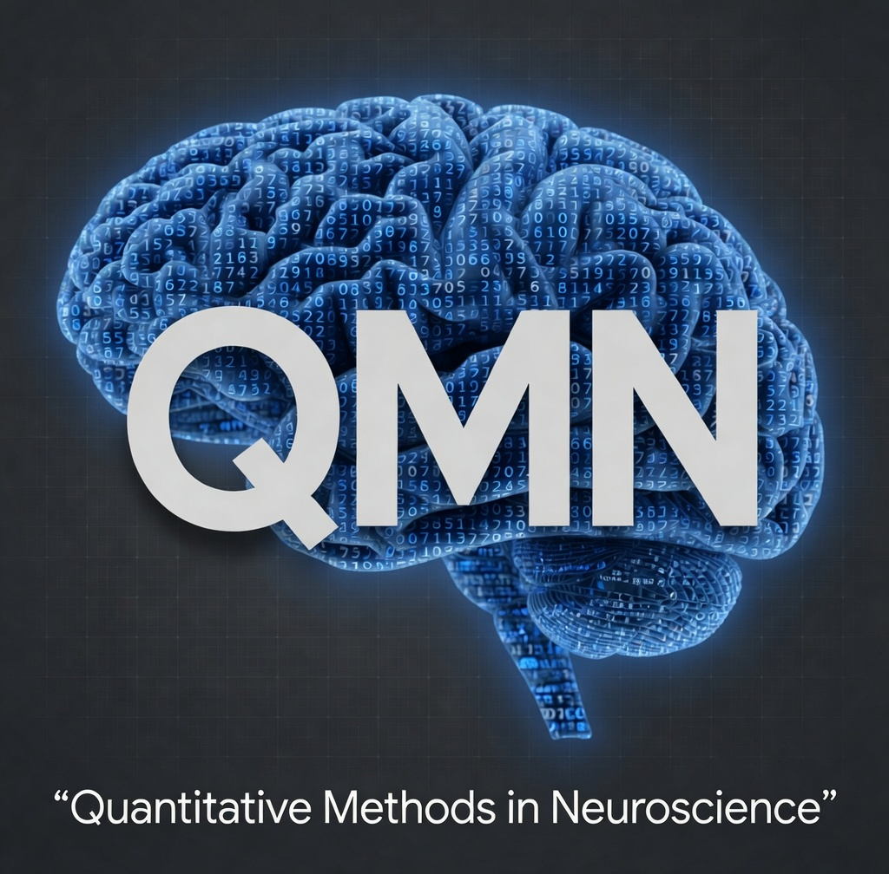

<p align="center">
  
</p>

# Quantitative Methods in Neuroscience (QMN)

Practical notebooks for the **Quantitative Methods in Neuroscience** course — Master in Neuroscience, University of Geneva (2026-27), taught by Prof. Sami El-Boustani.

> **Status (August 2026) — development repository.**
> All thirteen teaching weeks now have a draft, written by the teaching team and under review. Notebooks are committed **with their outputs**, so a reviewer can read what a notebook produces without running it, and most of them still contain the solutions. The student-facing repository, with solutions removed, is generated from this one at the end.

## Getting started

See [`SETUP_INSTRUCTIONS.txt`](SETUP_INSTRUCTIONS.txt) for the full setup guide: install conda, create the `qmn` environment from `environment.yml`, register the Jupyter kernel, open a notebook.

Every notebook runs in the same environment, `qmn`, and reads its data from `notebooks/data/` through a path that works wherever the notebook is opened from:

```python
from pathlib import Path
ROOT = Path.cwd() if (Path.cwd() / "data").is_dir() else Path.cwd().parent
trials = pd.read_csv(ROOT / "data" / "ibl_2afc.csv.gz")
```

## The weekly notebooks

One folder, one file per week, named `NN_topic[_vN][_TA|_student].ipynb`. `_TA` carries the solutions, `_student` is the version handed out. Superseded drafts live in `notebooks/legacy/`.

| Week | Topic | Notebook |
|---|---|---|
| 1 | Programming and Python fundamentals | `01_programming_fundamentals_v2_TA` |
| 2 | Math refresher and fundamental functions | `02_math_refresher_TA` |
| 3 | Probability and descriptive statistics | `03_probability_descriptive_TA` |
| 4 | Inference I: t-tests, effect size, power | `04_inference_ttests_power_TA` |
| 5 | Inference II: ANOVA and repeated measures | `05a_repeated_measures_practical_STUDENT`, `05b_anova_mechanics_advanced_STUDENT` |
| 6 | Non-parametrics, permutation, bootstrap | `06_nonparametrics_permutation_bootstrap_TA` |
| 7 | Correlation and regression | `07_regression_TA`, `07_regression_student` |
| 8 | Mixed-effects models | `08_mixed_effects_TA` |
| 9 | Linear algebra fundamentals | `09_linear_algebra_fundamentals_TA` |
| 10 | Linear algebra for statistics | `10_linear_algebra_statistics_TA` |
| 11 | Principal component analysis | `11_pca_alpha_TA` |
| 12 | Time series analysis | `12_time_series_TA` |
| 13 | Fourier analysis | `13_fourier_TA` |

Week 14 is the exam and has no practical.

## Datasets

Three real datasets serve the whole course, and each is used across several weeks so that students meet a new method rather than a new dataset every time. They live in `notebooks/data/` and are read from there, never downloaded and never duplicated.

- `ibl_2afc.csv.gz` and `ibl_2afc_subjects.csv` — behaviour of thirty mice from the International Brain Laboratory, used from Week 3 to Week 8. See `ibl_2afc_datadictionary.md`.
- `alphawaves.npz` — EEG with eyes open and eyes closed, used in Weeks 11 to 13.
- `erpcore_n170.npz` — the ERP CORE N170 face-perception set, for the evoked-response material. See `eeg_datadictionary.md` and the accompanying licence.

`notebooks/data/legacy/` holds material no live notebook reads any more, currently the synthetic 2AFC set that the first version of Notebook 2 was built on.

## Repository layout

```
QMN_course_2026/
├── README.md                  ← this file
├── SETUP_INSTRUCTIONS.txt     ← detailed setup guide
├── environment.yml            ← conda environment ("qmn")
├── .gitattributes             ← notebook outputs are kept, see the comment inside
├── .gitignore
├── misc/
│   └── cover_image.png
├── data_prep/                 ← TA-only: dataset build scripts and exploration notebooks
└── notebooks/
    ├── NN_topic_TA.ipynb      ← one per week, see the table above
    ├── assets/                ← images used by the notebooks
    ├── data/                  ← the course datasets, one copy of each
    │   └── legacy/            ← datasets no live notebook reads
    ├── legacy/                ← superseded drafts, kept for reference
    └── src/
        ├── __init__.py
        └── qmn_utils.py       ← shared helper functions
```
